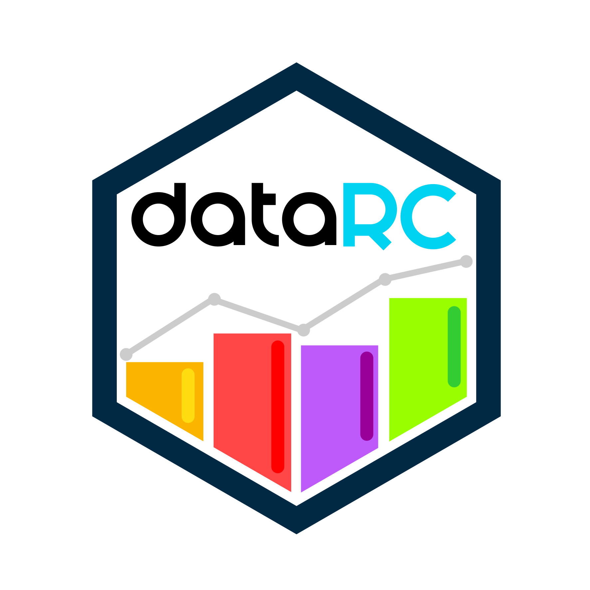

<!-- README.md is generated from README.Rmd. Please edit that file -->

```{r, include = FALSE}
knitr::opts_chunk$set(
  collapse = TRUE,
  comment = "#>",
  fig.path = "man/figures/README-",
  out.width = "100%"
)
```

# dataRC </a>


<!-- badges: start -->
<!-- badges: end -->

`dataRC` is an R package designed to bring efficient data management technologies to everyone. It aims to enhance efficiency in data handling by providing easy-to-use tools for converting files to Apache Parquet format, unifying heterogeneous databases, providing templates for data processing and more.  Whether you have little to none programming experience or are an advanced user, `dataRC` simplifies repetitive processes and boosts your productivity.

**Note:** dataRC has been released in its most basic form, but several features are currently inactive or under development. This includes supplementary materials such as vignettes, website and tutorials, which will be added in future updates. Additionally, we are in the process of preparing the package for submission to CRAN to ensure broader accessibility and stability for users. Thank you for your patience as we continue to improve and expand `dataRC` to meet your data management needs.

## Installation
At present, installation of the package is only supported from GitHub.
``` r
# install.packages("devtools")
devtools::install_github("jdrengifoc/dataRC")
```
If you also like to install the vignettes (see [Usage] section for more details) use the following command. However, if you have already installed the dependencies feel free to delete `dependencies = TRUE,` or skip the updates when asked in `Console`.
``` r
# install.packages("devtools")
devtools::install_github("jdrengifoc/dataRC", dependencies = TRUE, build_vignettes = TRUE)
```

## Usage

To learn how to use all `dataRC`'s features we provide different kinds of study material as shown in the following table.

<div align="center">
| Material         | Status       |
|------------------|--------------|
| Documentation    | Complete     |
| README           | Available    |
| Vignettes        | Available    |
| Website          | Available    |
| Video Tutorial   | Not started  |
</div>

The **documentation** provides a comprehensive information for each function. To see it you could load the library and use the symbol `?`.
```{r, echo = TRUE, eval = FALSE}
library(dataRC)
?convert_files
```
The **README** lacks presentation since you are reading it. Here you can find a simple usage example of three `dataRC`'s functions!
```{r convert_files, echo = TRUE, eval = FALSE}
library(dataRC)

# Convert all the .dta, .txt, and .csv files in the current folder into Parquet
# format and store them in the folder ./parquet_files.
convert_files(
  folder = ".", files = list.files(pattern = '(dta|txt|csv)$'),
  new_extension = "parquet", new_folder = '/parquet_files')

# Create a partial dictionary to ease data homogenization without making
# unexpected changes to original data.
dict_path <- 'dict.xlsx'
create_partial_dictionary(
  folder = '/parquet_files', files = list.files(), dict_path, verbose = F)
#Add descriptive statistics and sort the partial dictionary for final manual
review.
sort_partial_dictionary(dict_path, overwrite = T)
```

By its part, ***vignettes*** are guides that showcase full examples of workflows. While in the future, they will be accessible through the website, currently, the only way to view them is in `RStudio`. If you have installed vignettes properly (see [Installation] section), you could list the names of all available vignettes with `vignette(package = 'dataRC')`. Once you have identified the name of the ***vignettes***, lets say `process_data_with_partial_dict`, use the following command to visualize it. The **vignette** will render in the `help` pane.
```{r}
vignette('process_data_with_partial_dict', package = 'dataRC')
```

Finally, explore the complete project documentation, supplementary materials, and additional resources on the [website](https://jdrengifoc.github.io/dataRC/).

## Getting help
If you encounter a clear bug, please file an issue with a minimal reproducible example on [GitHub](https://github.com/jdrengifoc/dataRC/tree/main). If you don't know how to do this or have any suggestion, please feel free to write an email to jdrengifoc@eafit.edu.co. Please include the word `dataRC` in the subject.
